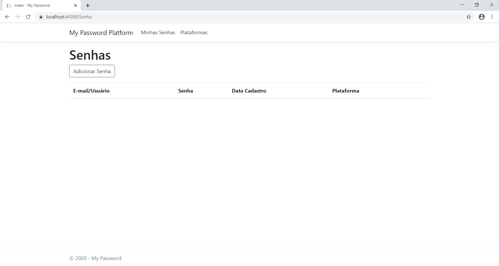
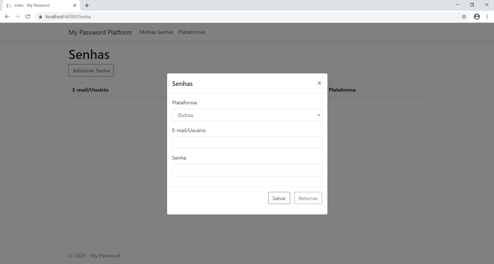
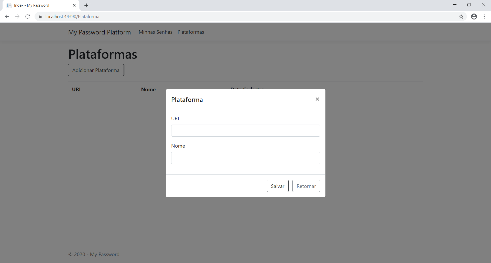

# Projeto de Estudo My Password Plataform #

Projeto desenvolvido utilizando conceitos de injeção de dependências nativo no .NET CORE,
Utilizando também $.ajax e ajax-unobtrusive para construção das telas.Aplicado tambem PartialView()
para construção de Modais baseadas no Bootstrap 4.

Espero que esse projeto possa te ajudar, assim como me ajudou no aprendizado de .NET CORE

## Prints

## Contato
Linkedin: https://www.linkedin.com/in/guilhermebatistamagalhaes/
